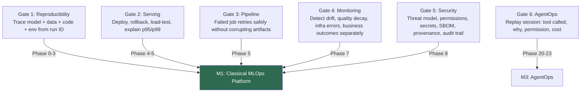
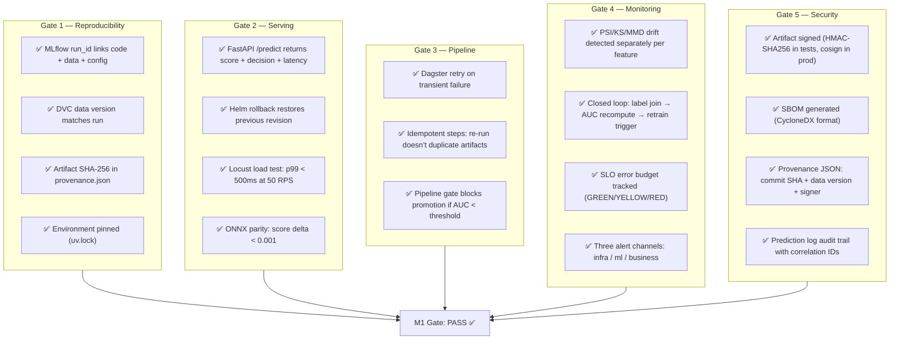
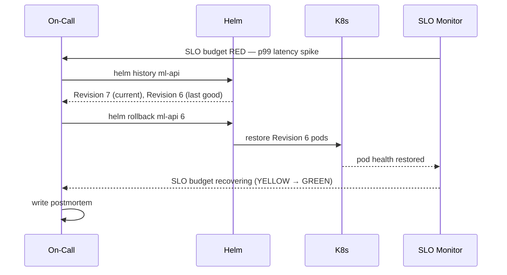

# Day 58 — Consolidation + Milestone 1 Gate

## What Milestone 1 Proves

> Given a **prediction**, you can trace the model version, data version, code version,
> feature values, request ID, and decision outcome — and you can roll back, retry a
> failed job safely, and detect drift/quality/infra/business issues separately.

This is the end of **Era A — Classical MLOps**. Everything built in Phases 0–8 now
fits together into one auditable, reproducible, monitorable system.

---

## The Six Production Gates



---

## Full Traceability Chain

A single `prediction_id` must resolve:

```
prediction_id: "pred-9f3b2e"
  ├── prediction_ts: 2026-06-29T10:15:22Z
  ├── entity_key:    "customer-42"
  ├── score:         0.731
  ├── decision:      "decline"
  │
  ├── model_version: "credit-risk-v1.2"
  │     ├── mlflow_run_id: "abc123def456"
  │     │     ├── code_sha:   "6c6a398"
  │     │     ├── params:     {"max_iter": 100, "C": 0.1}
  │     │     └── metrics:    {"auc": 0.847, "ks": 0.412}
  │     └── data_version: "v1"
  │           └── dvc_commit: "8f2e..."
  │
  ├── features (at request time, PIT-correct):
  │     ├── age:          38
  │     ├── income:       62_000
  │     ├── derog_marks:  2
  │     └── loan_amount:  25_000
  │
  ├── correlation_id: "req-abc-001"   # request-level trace (multiple services)
  │
  └── outcome (when available):
        ├── outcome_ts: 2026-07-29T08:00:00Z
        └── default:    0
```

---

## Milestone 1 Gate Checklist



---

## Phase-by-Phase Build Map

| Phase | Days | What was built | Gate |
|---|---|---|---|
| 0 | 1–6 | Orientation, system design, DVC, stack | — |
| 1 | 7–9 | Reproducibility: MLflow, DVC integration | G1 |
| 2 | 10–14 | Experiment tracking, model registry | G1 |
| 3 | 15–18 | Calibration, threshold, slice eval, Phase 3 gate | G1 |
| 4 | 19–28 | Serving: FastAPI, BentoML, batch, ONNX, load test | G2 |
| 5 | 29–37 | Pipelines: Dagster, ZenML, failure modes, gate | G3 |
| 6 | 38–45 | Feature store, PIT join, materialization, feedback | G1+G3 |
| 7 | 46–53 | Monitoring: drift, Prometheus, Grafana, closed loop, SLO | G4 |
| 8 | 54–58 | CI/CD: ML testing pyramid, GitLab CI, signing, SBOM | G5 |

---

## Rollback Procedure (CD)



---

## What You Now Have: Era A Summary

```
platform/
  training/       ← reproducible training, MLflow, HPO, calibration, registry
  serving/        ← FastAPI, BentoML, ONNX, batch, load test, security
  pipelines/      ← Dagster, ZenML, failure modes, validation + pipeline gates
  features/       ← feature store, PIT join, materialization, streaming, skew
  monitoring/     ← drift, Evidently, Prometheus, Grafana, prediction log, SLO
  ci/             ← ML testing pyramid, GitLab CI builder, signing, SBOM, M1 gate
```

End of **Era A — Classical MLOps**. Next: **Era B — LLMOps**.
