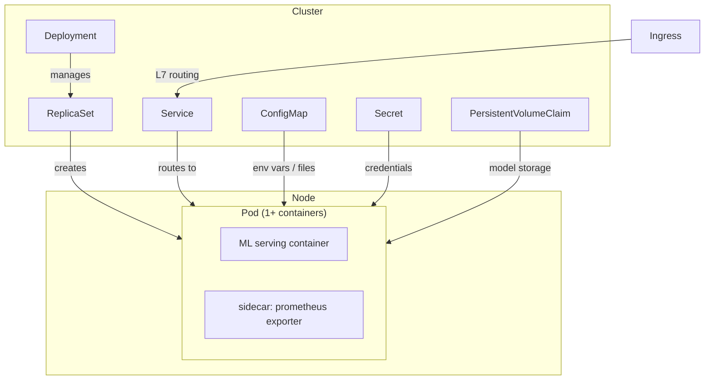
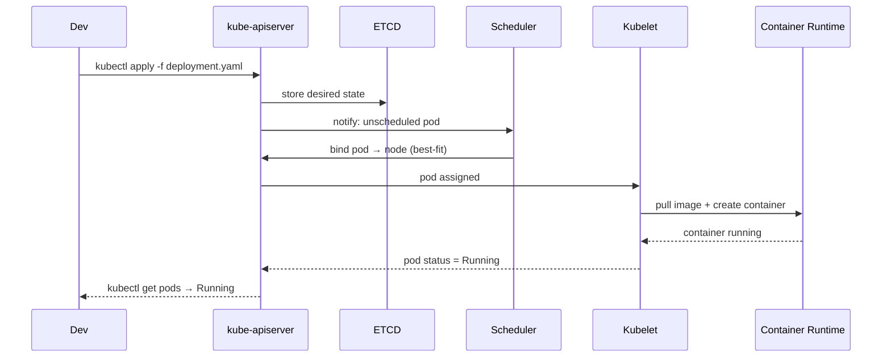
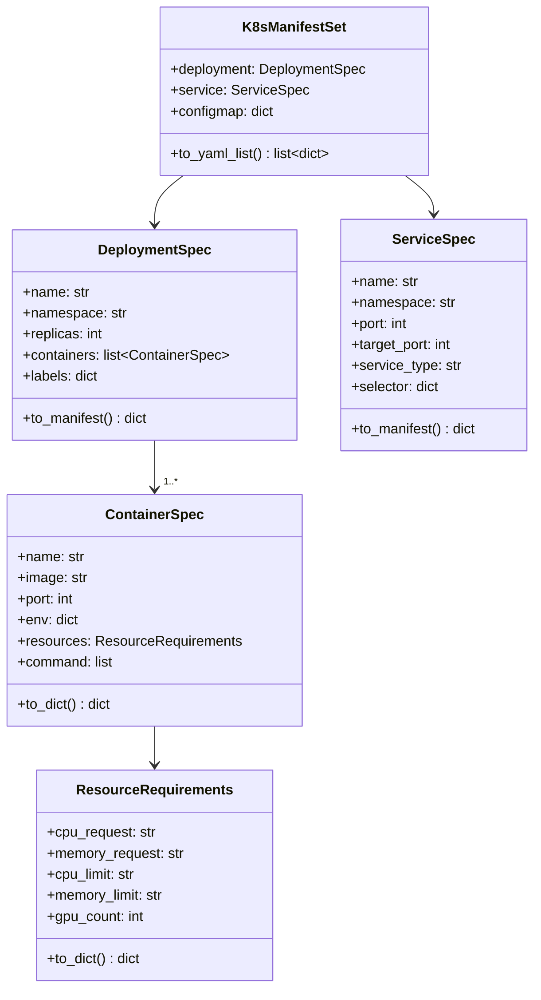

# Day 59 — Kubernetes for ML: Pods, Deployments, Services, Config/Secrets, Resources

## Why Kubernetes for ML?

Classical containerisation (Docker + docker-compose) handles one machine. Kubernetes (K8s) handles a fleet:

| Concern | Docker Compose | Kubernetes |
|---|---|---|
| Scheduling | Manual | Automatic (bin-packing) |
| Self-healing | No | Restarts, replaces failed pods |
| Scaling | Manual | HPA / KEDA / Karpenter |
| GPU allocation | `--gpus all` (one host) | Device plugin (any node) |
| Rolling deploys | Recreate | Rolling update / canary |
| Config / secrets | .env file | ConfigMap / Secret (encrypted at rest) |

---

## Core Primitives



### Pod

Smallest deployable unit. One or more containers sharing network namespace and volumes.

```yaml
apiVersion: v1
kind: Pod
spec:
  containers:
    - name: credit-risk-api
      image: credit-risk:v1.2
      resources:
        requests: {cpu: "500m", memory: "512Mi"}
        limits:   {cpu: "1",    memory: "1Gi"}
```

**Resource key rules:**
- `requests` = scheduling guarantee (node must have this free)
- `limits` = hard cap (OOMKilled if memory exceeded; CPU throttled)
- For ML serving: set `requests ≈ 50% of limits` to allow burst

### Deployment

Manages desired state for a set of pods (rolling update, rollback).

```yaml
spec:
  replicas: 3
  strategy:
    type: RollingUpdate
    rollingUpdate:
      maxUnavailable: 1   # at most 1 pod down at a time
      maxSurge: 1         # at most 1 extra pod during update
```

### Service (ClusterIP / NodePort / LoadBalancer)

| Type | Reachable from | Use |
|---|---|---|
| ClusterIP | Inside cluster | Pod-to-pod |
| NodePort | Host network | Local dev / kind |
| LoadBalancer | Internet | Cloud ELB / NLB |

### ConfigMap vs Secret

| | ConfigMap | Secret |
|---|---|---|
| Content | Non-sensitive config | Credentials, tokens |
| Storage | Plain text | Base64 (etcd encryption at rest) |
| Use | env vars, mounted files | env vars, image pull secrets |
| Example | `MLFLOW_TRACKING_URI` | `POSTGRES_PASSWORD` |

---

## ML-Specific Resource Patterns

### CPU-only serving (tabular model)

```yaml
resources:
  requests:
    cpu: "500m"
    memory: "512Mi"
  limits:
    cpu: "2"
    memory: "2Gi"
```

### GPU serving (LLM / embedding)

```yaml
resources:
  requests:
    nvidia.com/gpu: "1"   # requires NVIDIA device plugin
  limits:
    nvidia.com/gpu: "1"   # request == limit for GPUs (non-fractional)
```

### Init-container pattern for model download

```yaml
initContainers:
  - name: model-downloader
    image: amazon/aws-cli:latest
    command: ["aws", "s3", "cp", "s3://models/credit-risk-v1.pkl", "/model/"]
    volumeMounts:
      - name: model-volume
        mountPath: /model
containers:
  - name: api
    image: credit-risk-api:v1
    volumeMounts:
      - name: model-volume
        mountPath: /model   # model ready before API starts
volumes:
  - name: model-volume
    emptyDir: {}
```

---

## Sequence: kubectl apply → pod running



---

## Class Diagram (Python manifest builder)



---

## Five ML-K8s Invariants

| # | Invariant | Why it matters |
|---|---|---|
| 1 | Always set both `requests` AND `limits` | Without requests, scheduler can't place pods; without limits, one runaway pod OOMKills others |
| 2 | GPU limits = GPU requests | GPU is non-fractional — any mismatch causes scheduling failure |
| 3 | Liveness ≠ Readiness probe | Liveness restarts; Readiness gates traffic. Model warmup takes time — readiness must wait for model load |
| 4 | ConfigMap for config, Secret for credentials | Mixing them risks accidental credential exposure in plain ConfigMaps |
| 5 | Init-container for model pull | Avoids race condition: API starts before model file is ready |
