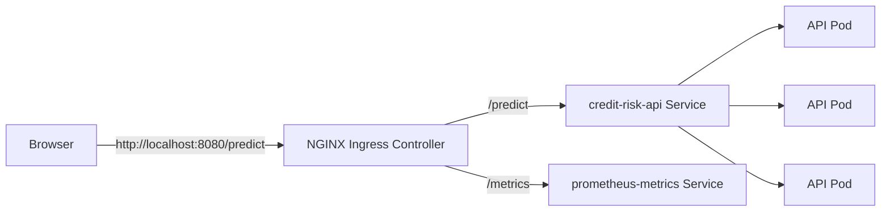
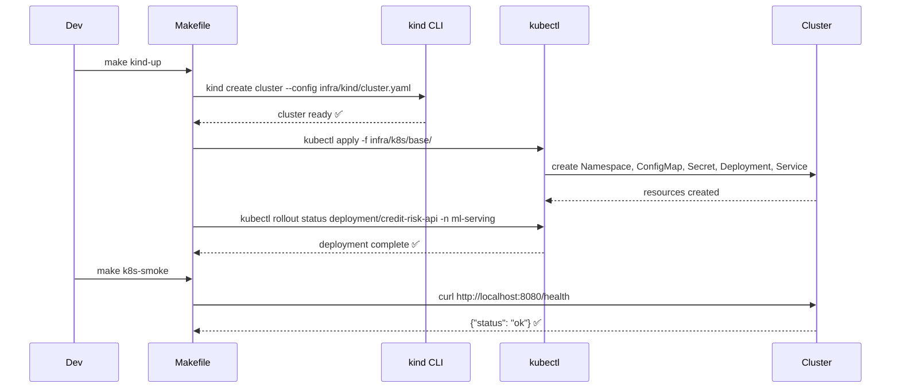
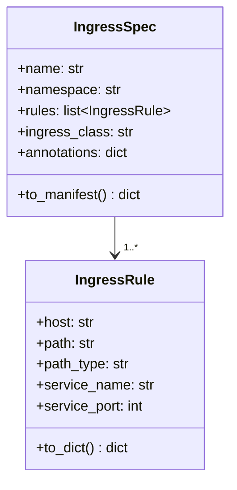

# Day 60 — kind Cluster: Deploy Service + Ingress

## What is kind?

**kind** (Kubernetes IN Docker) runs a full K8s cluster inside Docker containers.
It is the standard local-dev K8s for ML teams — no VMs, no cloud bill, reproducible CI.

```
Host machine
└── Docker
    ├── kind-control-plane container  ← kube-apiserver, etcd, scheduler
    ├── kind-worker-1 container       ← runs ML serving pods
    └── kind-worker-2 container       ← runs ML serving pods
```

---

## Cluster Config

```yaml
# infra/kind/cluster.yaml
kind: Cluster
apiVersion: kind.x-k8s.io/v1alpha4
name: mlops-local
nodes:
  - role: control-plane
    kubeadmConfigPatches:
      - |
        kind: InitConfiguration
        nodeRegistration:
          kubeletExtraArgs:
            node-labels: "ingress-ready=true"
    extraPortMappings:
      - containerPort: 80
        hostPort: 8080      # http://localhost:8080 → nginx ingress
      - containerPort: 443
        hostPort: 8443
  - role: worker
    labels:
      node-type: ml-serving
  - role: worker
    labels:
      node-type: ml-serving
```

---

## Ingress

Ingress is a Layer-7 HTTP router that maps hostnames/paths to services:



```yaml
# infra/k8s/base/ingress.yaml
apiVersion: networking.k8s.io/v1
kind: Ingress
metadata:
  name: ml-serving-ingress
  namespace: ml-serving
  annotations:
    nginx.ingress.kubernetes.io/rewrite-target: /
spec:
  ingressClassName: nginx
  rules:
    - host: localhost
      http:
        paths:
          - path: /predict
            pathType: Prefix
            backend:
              service:
                name: credit-risk-api
                port:
                  number: 80
          - path: /health
            pathType: Prefix
            backend:
              service:
                name: credit-risk-api
                port:
                  number: 80
```

---

## Deployment Sequence: git push → running in kind



---

## Key kind + kubectl Commands

```bash
# Create cluster
kind create cluster --name mlops-local --config infra/kind/cluster.yaml

# Load local Docker image into kind (avoids registry)
kind load docker-image credit-risk-api:v1 --name mlops-local

# Apply all base manifests
kubectl apply -f infra/k8s/base/ -n ml-serving

# Watch rollout
kubectl rollout status deployment/credit-risk-api -n ml-serving

# Port-forward for quick testing (no ingress needed)
kubectl port-forward svc/credit-risk-api 8080:80 -n ml-serving

# Rollback
kubectl rollout undo deployment/credit-risk-api -n ml-serving

# Delete cluster
kind delete cluster --name mlops-local
```

---

## IngressSpec Builder (Python)


