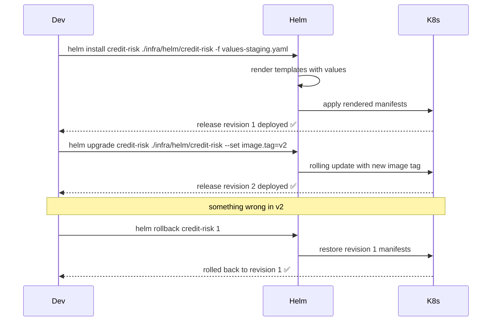
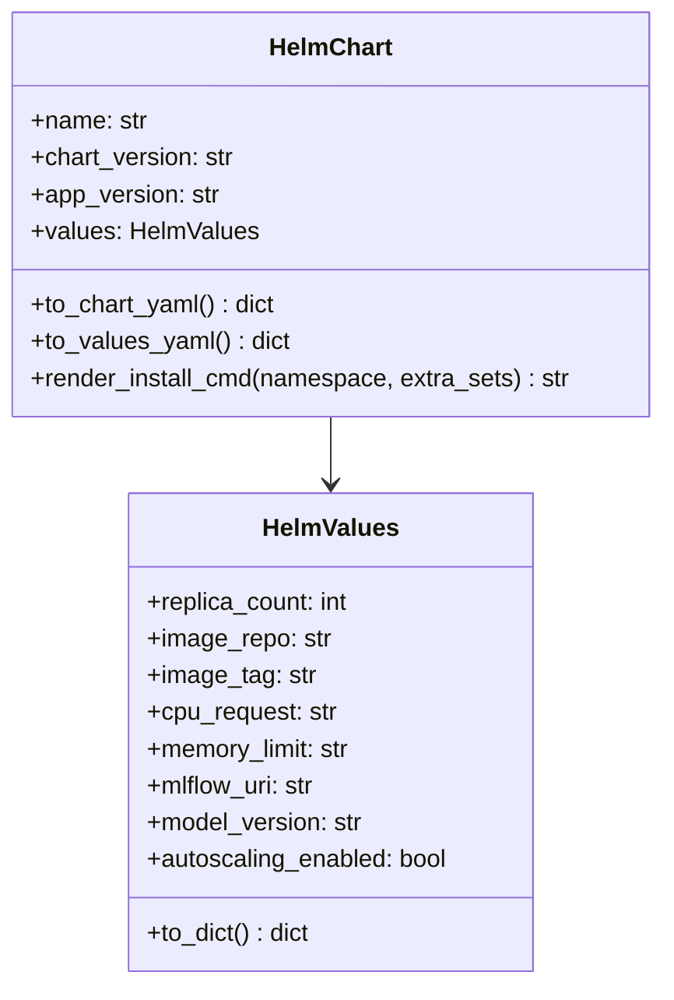

# Day 61 — Helm Chart the Service

## What is Helm?

Helm is the K8s package manager. A **chart** is a directory of templated YAML.
`helm install` renders the templates with user-supplied `values.yaml` and applies
the manifests to the cluster.

```
infra/helm/credit-risk/
├── Chart.yaml          ← chart metadata
├── values.yaml         ← default values (overridden per environment)
└── templates/
    ├── _helpers.tpl    ← reusable template snippets
    ├── deployment.yaml
    ├── service.yaml
    ├── configmap.yaml
    ├── ingress.yaml
    └── hpa.yaml
```

---

## Why Helm over raw kubectl apply?

| Raw kubectl apply | Helm |
|---|---|
| No rollback | `helm rollback <release> <revision>` |
| No history | `helm history <release>` |
| No templating | `{{ .Values.image.tag }}` |
| No lifecycle hooks | pre-install, post-upgrade, pre-delete |
| No release grouping | all resources grouped as one release |

---

## Chart.yaml

```yaml
apiVersion: v2
name: credit-risk
description: Credit risk ML serving API
type: application
version: 0.1.0        # chart version (bump on chart changes)
appVersion: "1.2.0"   # model version (bump on model changes)
```

## values.yaml (default)

```yaml
replicaCount: 3

image:
  repository: credit-risk-api
  tag: v1
  pullPolicy: IfNotPresent

service:
  type: ClusterIP
  port: 80

resources:
  requests:
    cpu: 500m
    memory: 512Mi
  limits:
    cpu: "2"
    memory: 2Gi

config:
  mlflowUri: http://mlflow:5000
  modelVersion: credit-risk-v1.2
  modelS3Path: s3://ml-models/credit-risk/v1.2/model.pkl

ingress:
  enabled: true
  className: nginx
  host: localhost

autoscaling:
  enabled: false
  minReplicas: 2
  maxReplicas: 10
  targetCPUUtilizationPercentage: 70
```

---

## Template: deployment.yaml

```yaml
apiVersion: apps/v1
kind: Deployment
metadata:
  name: {{ include "credit-risk.fullname" . }}
  labels:
    {{- include "credit-risk.labels" . | nindent 4 }}
spec:
  replicas: {{ .Values.replicaCount }}
  selector:
    matchLabels:
      {{- include "credit-risk.selectorLabels" . | nindent 6 }}
  template:
    metadata:
      labels:
        {{- include "credit-risk.selectorLabels" . | nindent 8 }}
    spec:
      containers:
        - name: {{ .Chart.Name }}
          image: "{{ .Values.image.repository }}:{{ .Values.image.tag }}"
          imagePullPolicy: {{ .Values.image.pullPolicy }}
          ports:
            - containerPort: 8080
          resources:
            {{- toYaml .Values.resources | nindent 12 }}
          env:
            - name: MLFLOW_TRACKING_URI
              value: {{ .Values.config.mlflowUri | quote }}
            - name: MODEL_VERSION
              value: {{ .Values.config.modelVersion | quote }}
```

---

## Helm Release Lifecycle



---

## Environment Override Pattern

```bash
# Staging
helm upgrade --install credit-risk ./infra/helm/credit-risk \
  --values infra/helm/credit-risk/values.yaml \
  --set image.tag=$CI_COMMIT_SHA \
  --set replicaCount=1 \
  --namespace ml-staging

# Production
helm upgrade --install credit-risk ./infra/helm/credit-risk \
  --values infra/helm/credit-risk/values.yaml \
  --values infra/helm/credit-risk/values-prod.yaml \
  --set image.tag=$CI_COMMIT_SHA \
  --namespace ml-prod
```

---

## HelmChart Builder (Python)


