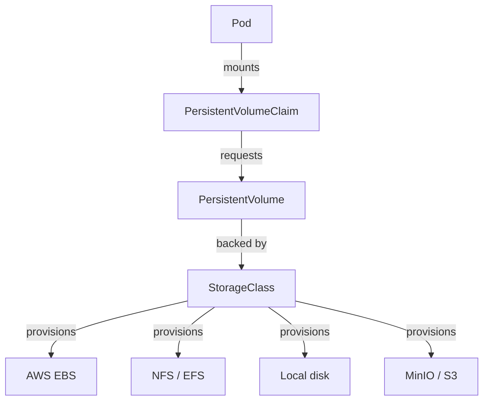
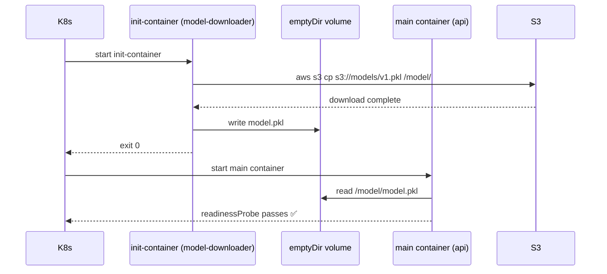
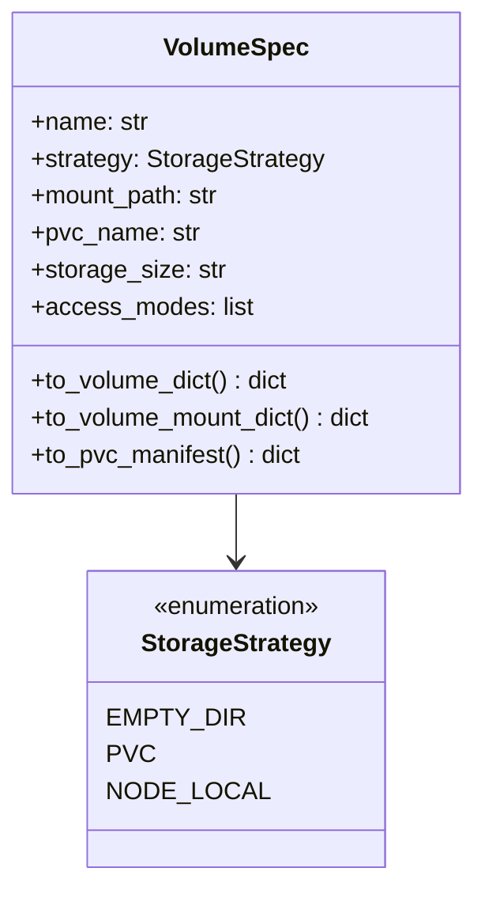

# Day 62 — Storage on K8s: PVCs, Model-Storage Strategies, Init-Container Pulls

## The Storage Drag Problem

ML models are large binary files (100 MB – 10 GB). Every pod restart that must
re-download the model adds latency to scaling events:

```
Without storage strategy:
  Pod starts → pulls 2 GB model from S3 → serving ready in 3 min

With init-container + PVC:
  Pod starts → reads model from PVC (already present) → serving ready in 15s

With node-local cache (PVC per node):
  First pod on node: downloads 2 GB once
  Subsequent pods: reads from node cache → serving ready in 15s
```

---

## Kubernetes Storage Primitives



### StorageClass

```yaml
apiVersion: storage.k8s.io/v1
kind: StorageClass
metadata:
  name: ml-model-storage
provisioner: kubernetes.io/no-provisioner   # local for kind
volumeBindingMode: WaitForFirstConsumer
reclaimPolicy: Retain   # don't delete PV when PVC deleted
```

### PVC for model storage

```yaml
apiVersion: v1
kind: PersistentVolumeClaim
metadata:
  name: model-cache
  namespace: ml-serving
spec:
  accessModes: [ReadOnlyMany]   # multiple pods can read same PV
  resources:
    requests:
      storage: 5Gi
  storageClassName: ml-model-storage
```

---

## Three Model-Storage Strategies

| Strategy | How | Cold-start | Pod lifecycle | Best for |
|---|---|---|---|---|
| **emptyDir** | Download in init-container per pod | Slow (per pod) | Lost on pod death | Dev / small models |
| **PVC (ReadOnlyMany)** | Download once → shared PVC | Fast (one-time) | Survives restarts | CPU serving, medium models |
| **Node-local PV** | First pod downloads, rest read cache | Fast after first | Node-local | GPU serving (DaemonSet) |

---

## Init-Container Pull Pattern



---

## PVC Strategy YAML

```yaml
# Shared model PVC — download once, mounted ReadOnly by all pods
apiVersion: v1
kind: PersistentVolumeClaim
metadata:
  name: model-cache
spec:
  accessModes: [ReadOnlyMany]
  resources:
    requests:
      storage: 5Gi
---
# Job that downloads model once into PVC
apiVersion: batch/v1
kind: Job
metadata:
  name: model-seeder
spec:
  template:
    spec:
      containers:
        - name: seeder
          image: amazon/aws-cli:2.15.0
          command: [aws, s3, cp, "$(MODEL_S3_PATH)", /model/model.pkl]
          volumeMounts:
            - name: model-pvc
              mountPath: /model
      volumes:
        - name: model-pvc
          persistentVolumeClaim:
            claimName: model-cache
      restartPolicy: OnFailure
```

---

## StorageStrategy Enum and VolumeSpec (Python)


