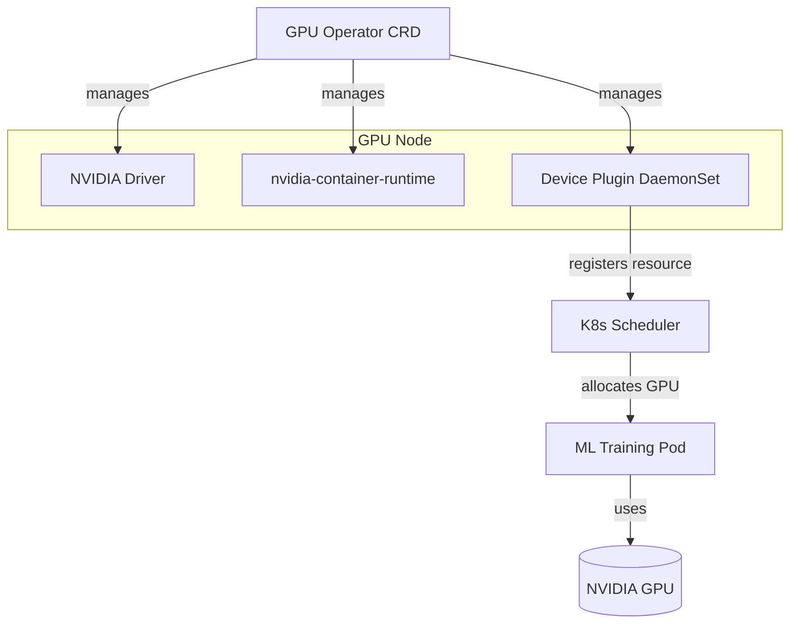
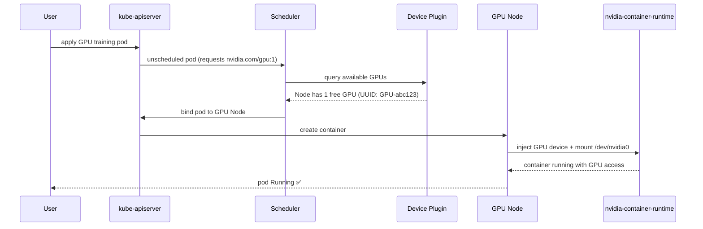
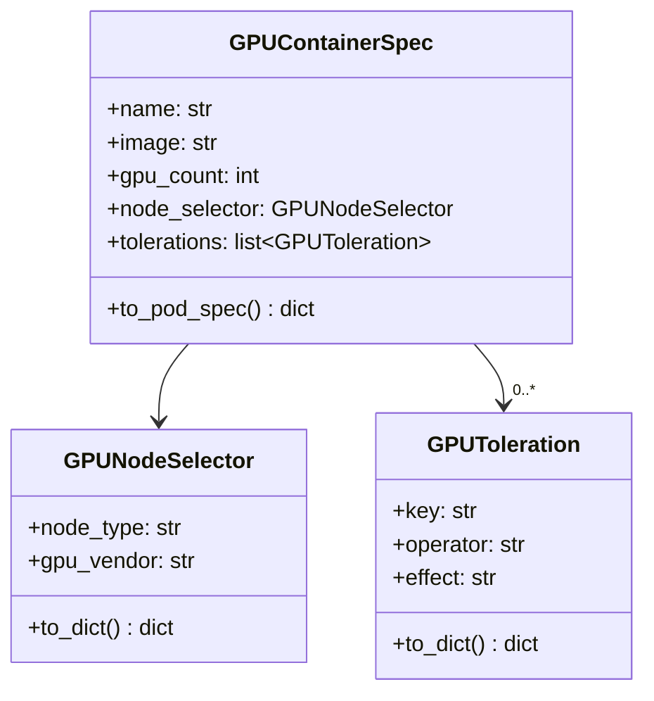

# Day 63 — GPU on K8s: NVIDIA GPU Operator, Device Plugin, Selectors/Taints

## How K8s Sees GPUs

GPUs are not visible to K8s by default. Two components are needed:

1. **NVIDIA Device Plugin** — runs as a DaemonSet on every GPU node; registers
   `nvidia.com/gpu` as a schedulable resource
2. **NVIDIA GPU Operator** — installs and manages the device plugin, drivers,
   container runtime config, and monitoring (DCGM exporter) via a single CRD



---

## Node Selectors + Taints

GPU nodes are expensive. We taint them so only GPU-requesting pods land there.

### Taint the GPU node

```bash
kubectl taint nodes gpu-node-1 nvidia.com/gpu=present:NoSchedule
```

### Pod spec: tolerate taint + select GPU node

```yaml
spec:
  nodeSelector:
    node-type: gpu
    nvidia.com/gpu: "true"
  tolerations:
    - key: "nvidia.com/gpu"
      operator: "Exists"
      effect: "NoSchedule"
  containers:
    - name: training
      image: pytorch/pytorch:2.2.0-cuda12.1-cudnn8-runtime
      resources:
        requests:
          nvidia.com/gpu: "1"
        limits:
          nvidia.com/gpu: "1"
```

**Rules:**
- `nodeSelector` = affinity (this node has what I need)
- `tolerations` = permission to land on a tainted node
- Both are required for strict GPU isolation

---

## GPU Operator Installation (Helm)

```bash
helm repo add nvidia https://helm.ngc.nvidia.com/nvidia
helm repo update

helm install gpu-operator nvidia/gpu-operator \
  --namespace gpu-operator \
  --create-namespace \
  --set driver.enabled=true \
  --set toolkit.enabled=true \
  --set devicePlugin.enabled=true \
  --set dcgmExporter.enabled=true   # Prometheus metrics for GPU utilization
```

---

## GPU Metrics (DCGM Exporter)

Once GPU Operator is installed, Prometheus scrapes GPU metrics:

| Metric | Description |
|---|---|
| `DCGM_FI_DEV_GPU_UTIL` | GPU core utilization (%) |
| `DCGM_FI_DEV_MEM_COPY_UTIL` | Memory bandwidth utilization (%) |
| `DCGM_FI_DEV_FB_USED` | GPU VRAM used (MiB) |
| `DCGM_FI_DEV_FB_FREE` | GPU VRAM free (MiB) |
| `DCGM_FI_DEV_GPU_TEMP` | GPU temperature (°C) |
| `DCGM_FI_DEV_POWER_USAGE` | Power draw (W) |

---

## Sequence: GPU Pod Scheduling



---

## GPU Node Spec (Python builder)


