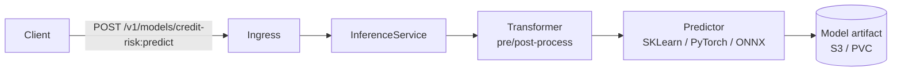
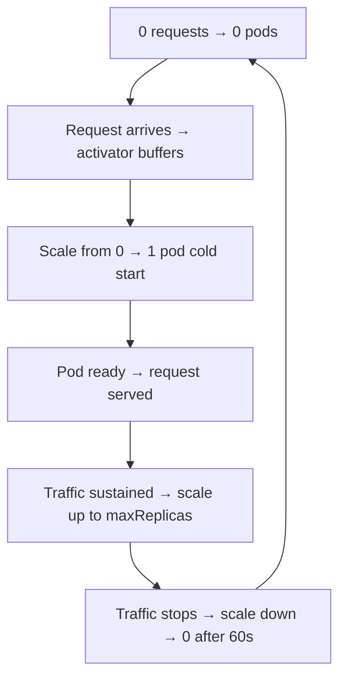
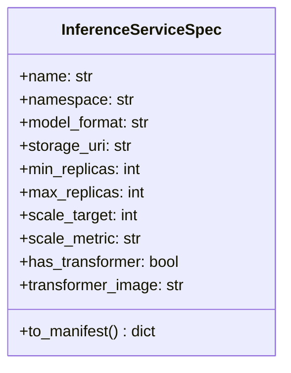

# Day 64 — KServe InferenceService: Predictor + Transformer, Scale-to-Zero

## What is KServe?

KServe (formerly KFServing) is a K8s-native model serving framework built on top of
Knative and Istio. It provides:

- **InferenceService CRD** — one YAML to deploy a model
- **Scale-to-zero** — pod count drops to 0 when no traffic; scales up on request
- **Protocol standardisation** — V2 Inference Protocol (REST + gRPC)
- **Transformer pipeline** — pre/post-processing sidecar before/after the predictor
- **Canary traffic splitting** — A/B test two model versions at the router level

---

## InferenceService Architecture



---

## InferenceService YAML

```yaml
apiVersion: serving.kserve.io/v1beta1
kind: InferenceService
metadata:
  name: credit-risk
  namespace: ml-serving
spec:
  predictor:
    model:
      modelFormat:
        name: sklearn           # or pytorch, onnx, tensorflow, lightgbm
      storageUri: s3://ml-models/credit-risk/v1.2/
      resources:
        requests:
          cpu: 500m
          memory: 512Mi
        limits:
          cpu: "2"
          memory: 2Gi
    minReplicas: 1
    maxReplicas: 10
    scaleTarget: 10             # scale when requests/pod > 10
    scaleMetric: rps
```

---

## Transformer Pattern

A transformer is a separate container that runs pre/post-processing:

```
Client request (raw JSON)
  → Transformer (feature extraction, normalisation)
  → Predictor (model inference)
  → Transformer (score formatting, decision band)
  → Client response
```

```yaml
spec:
  transformer:
    containers:
      - name: credit-risk-transformer
        image: credit-risk-transformer:v1
        resources:
          requests: {cpu: 200m, memory: 256Mi}
          limits: {cpu: "1", memory: 512Mi}
        env:
          - name: PREDICTOR_HOST
            value: localhost   # transformer calls predictor on localhost
  predictor:
    model:
      modelFormat: {name: sklearn}
      storageUri: s3://ml-models/credit-risk/v1.2/
```

---

## Scale-to-Zero

KServe uses Knative Serving's concurrency-based autoscaler:



- **Cold start**: 5–30s (model download + warmup)
- **Scale-up**: Knative autoscaler checks every 2s
- **Scale-to-zero delay**: `scaleToZeroGracePeriodSeconds: 60`

---

## KServe Spec Builder (Python)


