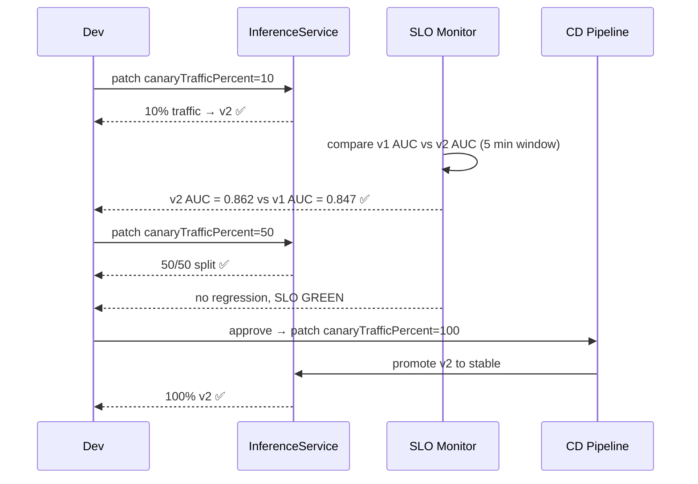
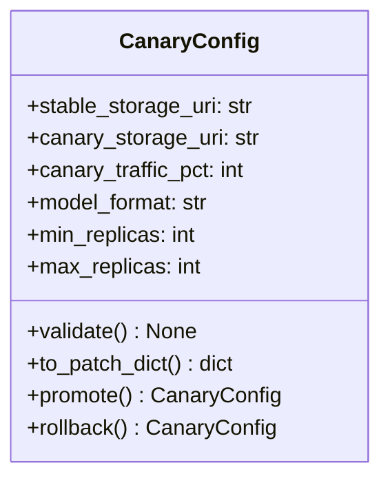

# Day 65 — KServe Canary, Traffic Splitting, Shadow/Mirror

## Why Canary for Models?

A canary deployment sends a small fraction of traffic to the new model version
before promoting it fully. This lets you detect accuracy regressions on real
traffic without impacting all users.

```
Before canary:   100% → model-v1
During canary:    95% → model-v1  +  5% → model-v2
After promote:   100% → model-v2
```

---

## Three Traffic Patterns

| Pattern | Traffic | New model receives | Use for |
|---|---|---|---|
| **Canary** | Live (split) | 5–20% of real requests | Gradual rollout with real feedback |
| **Shadow / Mirror** | Mirrored | 100% copy, responses discarded | Safe testing; zero user impact |
| **A/B** | Live (split by rule) | Specific user segment | Feature testing per user group |

---

## KServe Canary YAML

```yaml
apiVersion: serving.kserve.io/v1beta1
kind: InferenceService
metadata:
  name: credit-risk
  namespace: ml-serving
spec:
  predictor:
    canaryTrafficPercent: 20      # 20% to canary, 80% to stable
    model:
      modelFormat: {name: sklearn}
      storageUri: s3://ml-models/credit-risk/v2.0/   # canary model
      resources:
        requests: {cpu: 500m, memory: 512Mi}
        limits: {cpu: "2", memory: 2Gi}
```

For the **stable** version, the previous revision is kept in place automatically
by KServe. Canary traffic goes to the new spec; everything else to stable.

---

## Shadow / Mirror Mode

```yaml
spec:
  predictor:
    model:
      modelFormat: {name: sklearn}
      storageUri: s3://ml-models/credit-risk/v2.0/
  # Mirror: stable handles all real traffic; v2 gets mirrored copies
  canaryTrafficPercent: 0
```

Shadow mode is implemented at the Istio VirtualService level — KServe generates
the VirtualService automatically when `canaryTrafficPercent: 0` + the new version exists.

---

## Canary Promotion Sequence



---

## CanaryConfig Builder (Python)


