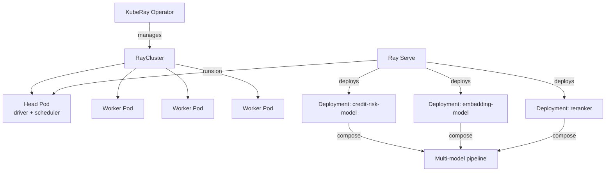

# Day 66 — Ray on K8s (KubeRay) + Ray Serve Multi-Model Pipelines

## Why Ray on K8s?

Ray is a distributed Python framework. **KubeRay** brings Ray clusters into K8s:



---

## RayCluster Manifest

```yaml
apiVersion: ray.io/v1alpha1
kind: RayCluster
metadata:
  name: ml-ray-cluster
  namespace: ml-serving
spec:
  headGroupSpec:
    serviceType: ClusterIP
    rayStartParams:
      dashboard-host: "0.0.0.0"
    template:
      spec:
        containers:
          - name: ray-head
            image: rayproject/ray:2.9.0
            resources:
              requests: {cpu: "2", memory: "4Gi"}
              limits: {cpu: "4", memory: "8Gi"}
  workerGroupSpecs:
    - replicas: 2
      minReplicas: 1
      maxReplicas: 8
      groupName: cpu-workers
      template:
        spec:
          containers:
            - name: ray-worker
              image: rayproject/ray:2.9.0
              resources:
                requests: {cpu: "2", memory: "4Gi"}
                limits: {cpu: "4", memory: "8Gi"}
```

---

## Ray Serve Multi-Model Pipeline

```python
import ray
from ray import serve

@serve.deployment(num_replicas=2, ray_actor_options={"num_cpus": 1})
class CreditRiskModel:
    def __init__(self):
        self.model = load_model("s3://models/credit-risk-v1/")

    async def __call__(self, request):
        features = await request.json()
        score = self.model.predict_proba([features])[0][1]
        return {"score": score}

@serve.deployment(num_replicas=1, ray_actor_options={"num_cpus": 0.5})
class EmbeddingModel:
    def __init__(self):
        self.encoder = SentenceTransformer("all-MiniLM-L6-v2")

    async def __call__(self, request):
        text = (await request.json())["text"]
        return {"embedding": self.encoder.encode(text).tolist()}

# Pipeline: compose two deployments
@serve.deployment
class MLPipeline:
    def __init__(self, credit_risk, embedder):
        self.credit_risk = credit_risk
        self.embedder = embedder

    async def __call__(self, request):
        data = await request.json()
        score_result = await self.credit_risk.remote(data)
        embed_result = await self.embedder.remote(data)
        return {"score": score_result["score"], "embedding": embed_result["embedding"]}

pipeline = MLPipeline.bind(CreditRiskModel.bind(), EmbeddingModel.bind())
serve.run(pipeline, route_prefix="/")
```

---

## Key Concepts

| Concept | Ray | KFP/Kubeflow |
|---|---|---|
| Unit of work | `@ray.remote` task / actor | Pipeline step (container) |
| Serving | `Ray Serve` deployments | KServe InferenceService |
| Distributed training | `ray.train` / `TorchTrainer` | Training Operator |
| Scheduling | Ray scheduler (per cluster) | K8s scheduler |
| State | Actor state in memory | Artifacts in storage |
| Best for | Python-native, streaming, ML pipelines | DAG orchestration |
