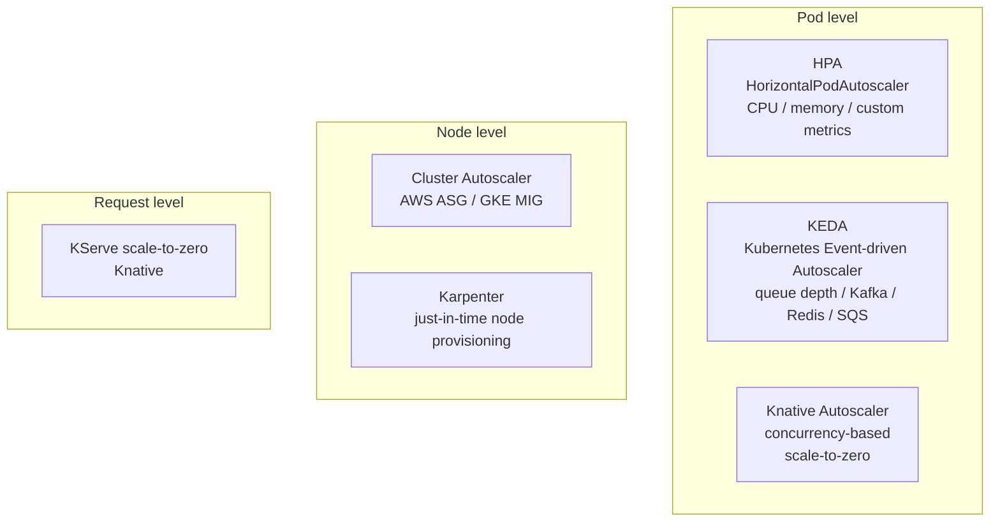
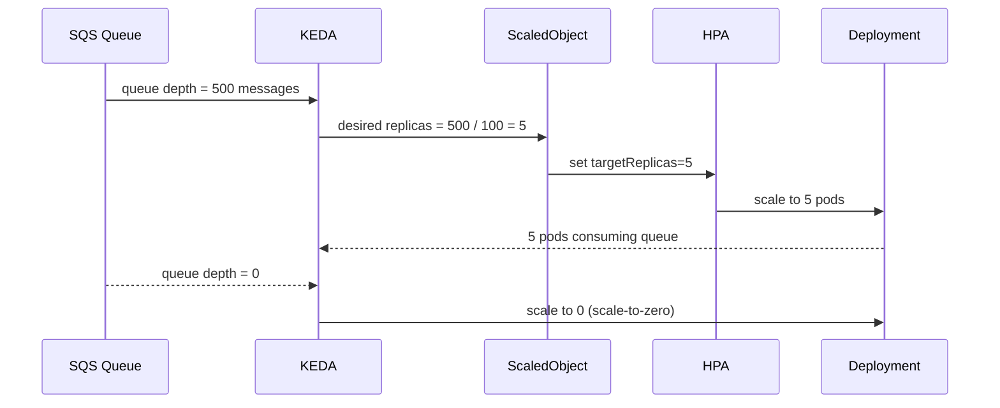

# Day 67 — Autoscaling: HPA, KEDA (Queue-Depth), Node Autoscaling

## Three Scaling Dimensions



---

## HPA — CPU-Based Scaling

```yaml
apiVersion: autoscaling/v2
kind: HorizontalPodAutoscaler
metadata:
  name: credit-risk-hpa
  namespace: ml-serving
spec:
  scaleTargetRef:
    apiVersion: apps/v1
    kind: Deployment
    name: credit-risk-api
  minReplicas: 2
  maxReplicas: 20
  metrics:
    - type: Resource
      resource:
        name: cpu
        target:
          type: Utilization
          averageUtilization: 70   # scale when avg CPU > 70%
    - type: Resource
      resource:
        name: memory
        target:
          type: Utilization
          averageUtilization: 80
```

---

## KEDA — Queue-Depth Scaling

KEDA is purpose-built for event-driven workloads. It scales pods based on
external metrics like SQS queue depth or Kafka consumer lag.



```yaml
apiVersion: keda.sh/v1alpha1
kind: ScaledObject
metadata:
  name: batch-inference-scaler
  namespace: ml-serving
spec:
  scaleTargetRef:
    name: batch-inference-worker
  minReplicaCount: 0
  maxReplicaCount: 50
  triggers:
    - type: aws-sqs-queue
      metadata:
        queueURL: https://sqs.us-east-1.amazonaws.com/123456789/ml-batch-jobs
        queueLength: "100"    # scale 1 pod per 100 queued items
        awsRegion: us-east-1
```

---

## Karpenter: Just-in-Time Node Provisioning

Cluster Autoscaler adds nodes reactively (waits for unschedulable pod).
**Karpenter** provisions the exact right node type in 30–60 seconds:

```yaml
apiVersion: karpenter.sh/v1alpha5
kind: Provisioner
metadata:
  name: ml-gpu-provisioner
spec:
  requirements:
    - key: karpenter.sh/capacity-type
      operator: In
      values: ["spot", "on-demand"]
    - key: node.kubernetes.io/instance-type
      operator: In
      values: ["p3.2xlarge", "p3.8xlarge", "g4dn.xlarge"]
  limits:
    resources:
      nvidia.com/gpu: "10"     # max 10 GPUs in cluster at once
  ttlSecondsAfterEmpty: 30     # terminate idle nodes after 30s
```

---

## Scaling Decision Matrix

| Metric | Tool | Best for |
|---|---|---|
| CPU utilization | HPA | Synchronous serving (latency-bound) |
| Memory utilization | HPA | Memory-intensive models |
| SQS / Kafka queue depth | KEDA | Async batch inference |
| Redis list length | KEDA | Task queue workers |
| Requests per second | KServe / Knative | Online model serving |
| Custom Prometheus metric | KEDA Prometheus trigger | ML-specific signals |
