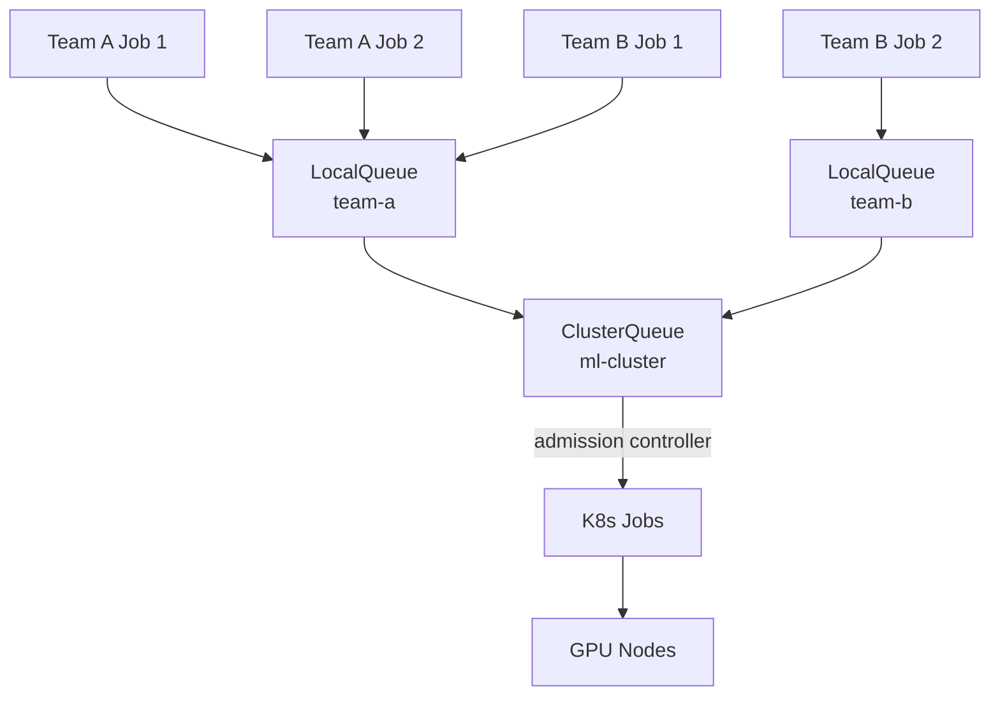
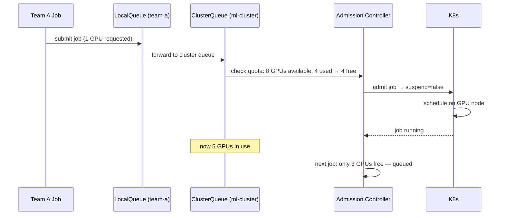

# Day 68 — Kueue GPU Scheduling: Job Queueing, Fair Sharing

## Why Kueue?

Without Kueue, GPU jobs compete for nodes directly through K8s. In a shared
cluster this means:
- Team A submits 10 training jobs and takes all GPUs
- Team B waits indefinitely
- No quotas, no fair-share, no priority

**Kueue** adds a job admission layer:



---

## ClusterQueue — Cluster-Level Resource Pool

```yaml
apiVersion: kueue.x-k8s.io/v1beta1
kind: ClusterQueue
metadata:
  name: ml-cluster
spec:
  namespaceSelector: {}    # all namespaces
  queueingStrategy: BestEffortFIFO
  resourceGroups:
    - coveredResources: ["cpu", "memory", "nvidia.com/gpu"]
      flavors:
        - name: default-flavor
          resources:
            - name: cpu
              nominalQuota: "100"
            - name: memory
              nominalQuota: 200Gi
            - name: nvidia.com/gpu
              nominalQuota: "8"    # cluster has 8 GPUs total
```

---

## LocalQueue — Per-Namespace Quota

```yaml
# Team A gets 4 GPUs max
apiVersion: kueue.x-k8s.io/v1beta1
kind: LocalQueue
metadata:
  name: team-a-queue
  namespace: team-a
spec:
  clusterQueue: ml-cluster
---
# Team B gets 4 GPUs max
apiVersion: kueue.x-k8s.io/v1beta1
kind: LocalQueue
metadata:
  name: team-b-queue
  namespace: team-b
spec:
  clusterQueue: ml-cluster
```

---

## Job with Kueue

```yaml
apiVersion: batch/v1
kind: Job
metadata:
  name: credit-risk-training
  namespace: team-a
  labels:
    kueue.x-k8s.io/queue-name: team-a-queue   # ← Kueue annotation
spec:
  template:
    spec:
      containers:
        - name: trainer
          image: credit-risk-trainer:v1
          resources:
            requests:
              nvidia.com/gpu: "1"
            limits:
              nvidia.com/gpu: "1"
      restartPolicy: OnFailure
```

---

## Kueue Scheduling Flow



---

## Fair-Sharing Concepts

| Concept | Description |
|---|---|
| **Nominal quota** | What the queue is "owed" — used for fair-share calculation |
| **Borrowing limit** | Can consume idle capacity from other queues |
| **Preemption** | Higher-priority job can evict lower-priority job |
| **LendingLimit** | How much a queue can lend to others |
| **BestEffortFIFO** | Default strategy: first-in-first-out, admit when quota allows |
| **StrictFIFO** | Never reorder; head-of-queue blocks even if back can fit |
