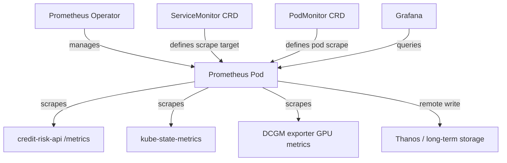
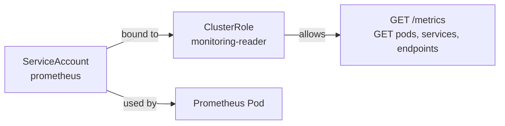
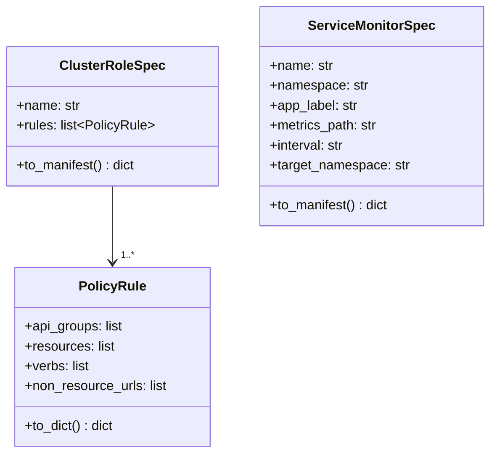

# Day 69 — Prometheus + Grafana on K8s + Secrets/RBAC — Threat Checkpoint

## Prometheus on K8s: Prometheus Operator

The **Prometheus Operator** adds K8s-native CRDs so you define *what to scrape*
declaratively instead of writing static scrape configs:



### ServiceMonitor for ML API

```yaml
apiVersion: monitoring.coreos.com/v1
kind: ServiceMonitor
metadata:
  name: credit-risk-api
  namespace: monitoring
spec:
  selector:
    matchLabels:
      app: credit-risk-api
  endpoints:
    - port: http
      path: /metrics
      interval: 30s
  namespaceSelector:
    matchNames: [ml-serving]
```

---

## RBAC for Monitoring



```yaml
apiVersion: rbac.authorization.k8s.io/v1
kind: ClusterRole
metadata:
  name: monitoring-reader
rules:
  - apiGroups: [""]
    resources: [pods, services, endpoints]
    verbs: [get, list, watch]
  - nonResourceURLs: ["/metrics"]
    verbs: [get]
---
apiVersion: rbac.authorization.k8s.io/v1
kind: ClusterRoleBinding
metadata:
  name: monitoring-reader-binding
roleRef:
  apiGroup: rbac.authorization.k8s.io
  kind: ClusterRole
  name: monitoring-reader
subjects:
  - kind: ServiceAccount
    name: prometheus
    namespace: monitoring
```

---

## Threat Checkpoint: Secrets at Scale

| Threat | Risk | Mitigation |
|---|---|---|
| Secret in ConfigMap | Credentials exposed in plain text | Use K8s Secret; never put creds in ConfigMap |
| Secret in container env | Visible in `kubectl describe pod` | Use Secret volume mount (file-based), not env |
| Secret in YAML committed to git | Long-term credential exposure | Sealed Secrets or External Secrets Operator |
| Prometheus scraping secrets | Credentials in metrics labels | Never expose credential values as label values |
| etcd unencrypted | Secrets readable from etcd | Enable EncryptionConfiguration for etcd at rest |
| Over-broad RBAC | Prometheus gets write access | Principle of least privilege; read-only ClusterRole |

### Sealed Secrets pattern

```bash
# Encrypt locally
kubeseal --cert pub-cert.pem < secret.yaml > sealed-secret.yaml

# Commit sealed-secret.yaml to git (safe — only cluster can decrypt)
# Sealed Secrets controller decrypts and creates Secret in cluster
```

---

## Grafana Dashboard ConfigMap

```yaml
apiVersion: v1
kind: ConfigMap
metadata:
  name: ml-dashboard
  namespace: monitoring
  labels:
    grafana_dashboard: "1"   # Grafana sidecar auto-imports
data:
  ml-golden-signals.json: |
    {
      "title": "ML Golden Signals",
      "panels": [...]
    }
```

---

## RBAC Spec Builder (Python)


