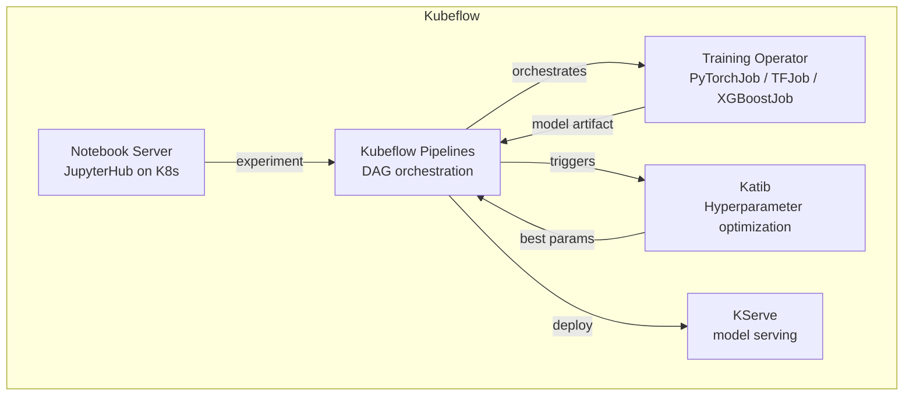
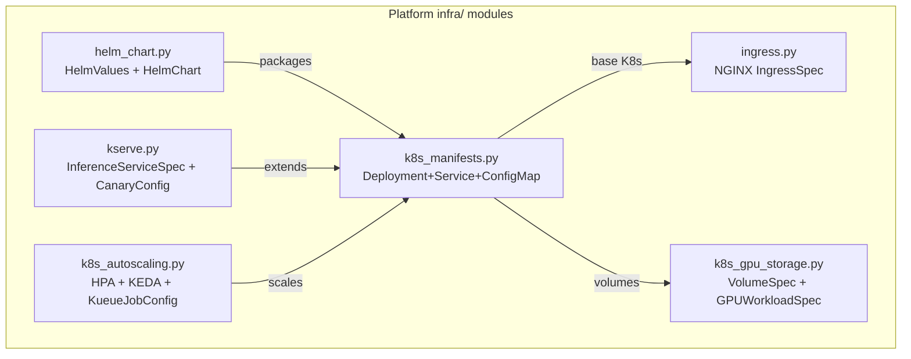

# Day 70 — Kubeflow Survey + Consolidation

## Kubeflow: The K8s-Native MLOps Platform

Kubeflow is a collection of ML tools that run on K8s. Unlike a single product,
it is a set of loosely coupled components you can adopt individually:



---

## Component Comparison

| Component | Purpose | Our stack equivalent |
|---|---|---|
| **KFP** | DAG pipeline orchestration | Dagster / ZenML (Phase 5) |
| **Katib** | Automated HPO (Bayesian, NAS, RL) | Optuna (Phase 2) |
| **Training Operator** | Distributed K8s training jobs | Custom K8s Job + Ray Train |
| **Notebook Server** | Managed JupyterHub + RBAC | Local Jupyter (dev only) |
| **KServe** | Model serving + canary | KServe (Days 64–65) |

---

## When to Use Kubeflow vs Our Stack

| Scenario | Use Kubeflow | Use our stack |
|---|---|---|
| Large team, many pipelines | ✅ KFP gives UI + tracking | Dagster also works |
| Distributed GPU training | ✅ Training Operator + Kueue | Ray Train on KubeRay |
| HPO at scale (> 100 trials) | ✅ Katib | Optuna (< 50 trials) |
| Reproducibility gate | Dagster (Phase 5) | ✅ |
| Closed-loop monitoring | MLflow + Phase 7 | ✅ |
| SBOM + signing | Phase 8 | ✅ |
| Serving with canary | ✅ KServe | Both |

---

## Phase 9 Consolidation: What We Built



| Day | Module | Key concept |
|---|---|---|
| 59 | `k8s_manifests.py` | Pods, Deployments, Services, ConfigMap/Secret |
| 60 | `ingress.py` | kind cluster, NGINX IngressSpec |
| 61 | `helm_chart.py` | Chart packaging, environment overrides |
| 62–63 | `k8s_gpu_storage.py` | PVC strategies, GPU device plugin, tolerations |
| 64–65 | `kserve.py` | InferenceService, canary traffic, scale-to-zero |
| 67–68 | `k8s_autoscaling.py` | HPA, KEDA, Kueue job queueing |
| 69 | `k8s_observability.py` | ServiceMonitor, ClusterRole, RBAC |
| 70 | Survey doc | Kubeflow vs our stack decision guide |

---

## K8s Gate Checklist

```
✅ Deployment with RollingUpdate + readiness/liveness probes
✅ init-container for model pull (no race condition)
✅ ResourceRequirements on all containers (requests + limits)
✅ GPU: nvidia.com/gpu in requests = limits; toleration + nodeSelector
✅ ConfigMap for config; Secret for credentials (never swap)
✅ NGINX Ingress routes /predict and /health
✅ Helm chart packages the service with per-env values.yaml
✅ HPA scales on CPU; KEDA scales on queue depth (scale-to-zero)
✅ Kueue enforces per-team GPU quota
✅ ServiceMonitor + ClusterRole for Prometheus scraping
✅ KServe InferenceService: predictor + optional transformer
✅ Canary: patch canaryTrafficPercent; rollback to 0 on regression
```
